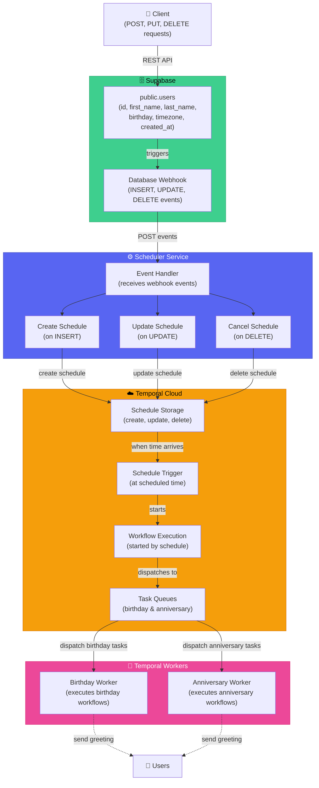

# Greeting Automation Project

An application that sends birthday greetings to users at **exactly 9am in their local timezone**. Designed for scalability, reliability, and easy extension to other greeting types.

---

## Table of Contents

- [Project Overview](#project-overview)  
- [Features](#features)  
- [Tech Stack](#tech-stack)  
- [API Endpoints](#api-endpoints)  
- [Architecture](#architecture)  
- [Setup](#setup)  
- [Running Locally](#running-locally)  
- [Testing](#testing)  
- [Assessment Requirements Coverage](#assessment-requirements-coverage)  
- [Future Extensions](#future-extensions)

---

## Project Overview

This project automates birthday and anniversary greetings using the following components:

### Supabase
- Stores user information in the `public.users` table.
- Auto-generates REST endpoints (POST, PUT, DELETE).
- Sends database webhook events on insert, update, or delete actions.

### Scheduler Service
- Receives webhook events from Supabase.
- Creates, updates, or cancels user schedules in Temporal.
- Ensures idempotency through the use of scheduleId field

### Temporal Cloud
- Orchestrates workflow execution and schedule management.
- Triggers workflows at scheduled times and manages workflow executions.

### Temporal Workers
- Execute workflow tasks for schedules.
- Dedicated workers process birthday and anniversary greetings.

---

## Features

- Sends birthday greetings at **9am local time** in each user's timezone (`location`).  
- Handles user creation, updating, and deletion.  
- Ensures **no duplicate messages** (idempotent schedules via Temporal).  
- Automatically retries messages if the service was down (recovery after downtime) by implementation.  
- Input validation with **Zod** and database constraints.  
- Extensible architecture for additional greeting types or future features.  

---

## Tech Stack

- **Language:** TypeScript  
- **Server:** Supabase/Deno
- **Database:** Supabase (PostgreSQL)  
- **Workflow Engine:** Temporal  
- **Scheduler:** NestJS for CRUD of temporal schedules  
- **Date Handling:** Temporal & Luxon for timezone-aware scheduling  
- **Testing:** Jest

---

## API Endpoints

Supabase automatically provides REST endpoints for the `users` table:

| Method | Endpoint | Description |
|--------|----------|-------------|
| POST   | `https://<project_ref>.supabase.co/rest/v1/users`  | Create a new user (first name, last name, birthday, timezone). |
| DELETE | `https://<project_ref>.supabase.co/rest/v1/users?id=eq.<user_id>`  | Delete a user by ID (also cancels scheduled greetings). |
| PUT    | `https://<project_ref>.supabase.co/rest/v1/users?id=eq.<user_id>`  | Update user details (bonus; updates Temporal schedule). |

### User Object Schema

```ts
interface User {
  id: string;
  firstName: string;
  lastName: string;
  birthday: string; // ISO date string
  timezone: string; // IANA timezone string, e.g., "Asia/Manila"
}
```

> **Note:** The `timezone` field represents the user’s **IANA timezone**, which ensures the birthday greeting is sent exactly at 9am local time without additional conversions.

---

## Architecture



---

## Setup

Setup instructions are provided **within each individual service folder**.  
Please refer to the corresponding **README.md** files for installation and configuration.

---

## Running Locally

Each component (Scheduler, Worker, Supabase) provides its own local run instructions in its respective folder.  
Follow each folder's README to run the system locally.

---


## Testing

```bash
yarn test
```

- Tests cover **API endpoints, Scheduler, and Worker workflows**.  
- Validates input via **Zod** and database constraints.

---

## Assessment Requirements Coverage

| Requirement | Status | Notes |
|-------------|--------|------|
| POST /user & DELETE /user | ✅ | Covered by Supabase endpoints (optionally wrapped in Express.js). |
| PUT /user (bonus) | ✅ | updates Temporal schedule if birthday changes. |
| User fields & timezone handling | ✅ | `location` is an IANA timezone; ensures 9am local delivery. |
| Send message at 9am local time | ✅ | Computed directly from `location` with Temporal scheduling. |
| Message delivery via webhook | ✅ | Hookbin endpoint used; full name dynamically inserted. |
| Recovery after downtime | ✅ | Temporal retries missed schedules automatically. |
| Race conditions / duplicates | ✅ | Idempotent Temporal schedules prevent duplicates. |
| Input validation | ✅ | Zod + SQL constraints validate fields. |
| Testing | ✅ | Unit and integration tests for API, Scheduler, and Worker. |
| Logging & monitoring | ⚠️ | Optional: structured logs for easier debugging. |

---
